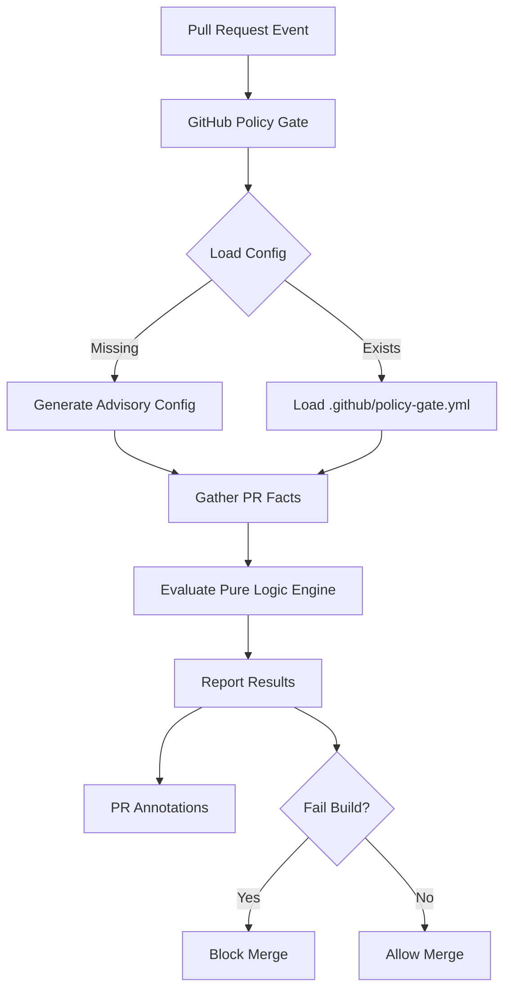

# GitHub Policy Gate

[](https://github.com/failuresmith/github-policy-gate/actions/workflows/ci.yml)
[](https://github.com/marketplace/actions/github-policy-gate)

`github-policy-gate` is a lightweight, zero-infrastructure GitHub Action that implements **Policy as Code** for your pull requests. It provides simple, declarative guardrails to ensure safer merges by checking file changes, labels, approvals, and more.

## Why GitHub Policy Gate?

- **Zero Infrastructure**: No bots, no webhooks, no databases, and no external services.
- **Human Friendly**: Policies are written in simple YAML that anyone on the team can read and update.
- **Safe by Default**: If no config is found, the action runs in advisory mode—it won't block your PRs by surprise.
- **Fast and Focused**: Only reads the data it needs to evaluate your specific policies.

## How it Works



## Quick Start

### 1. Add the Action to your workflow

Create `.github/workflows/policy.yml`:

```yaml
name: policy-gate
on: [pull_request]

jobs:
  check-policy:
    runs-on: ubuntu-latest
    permissions:
      contents: read
      pull-requests: read
    steps:
      - uses: actions/checkout@v4
      - uses: failuresmith/github-policy-gate@v1
```

### 2. Add your first policy

Create `.github/policy-gate.yml`:

```yaml
policies:
  - id: critical-path-tests
    severity: error
    when:
      changed: ['src/core/**']
    require:
      changed: ['tests/**']
    message: 'Changes to the core engine must include updated tests.'

  - id: documentation-check
    severity: warn
    require:
      changed: ['README.md', 'docs/**']
    message: 'Consider updating documentation for this change.'
```

## Inputs

| Input          | Description                                  | Default                   |
| :------------- | :------------------------------------------- | :------------------------ |
| `config-path`  | Path to the YAML policy file                 | `.github/policy-gate.yml` |
| `github-token` | GitHub token for reading PR facts            | `${{ github.token }}`     |
| `fail-on-warn` | Whether to fail the job on `warn` violations | `false`                   |

## Advanced Use Cases

GitHub Policy Gate supports complex logic using `all`, `any`, and `not` combinators:

```yaml
require:
  any:
    - approval_count_at_least: 2
    - has_label: ['fast-track']
    - all:
        - approval_count_at_least: 1
        - has_label: ['minor-fix']
```

## Documentation

- 🚀 [Quick Start Guide](docs/quick-start.md) - Get running in 2 minutes.
- 📖 [Configuration Reference](docs/configuration.md) - All available predicates and settings.
- 💡 [Policy Examples](docs/policy-examples.md) - Common patterns for teams.
- 🏗️ [Architecture](docs/architecture.md) - How the engine works.

## Local Development

```bash
make install    # Install dependencies
make check      # Run lints and types
make validate   # Run all tests
make build      # Build the production bundle
```

## License

This project is licensed under the PolyForm Noncommercial 1.0.0. See [LICENSE](LICENSE) for details.
