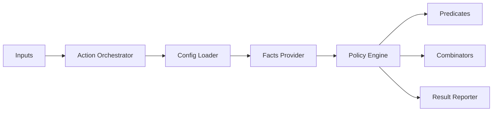

# Architecture

## Workflow

## Flow

1. **Load and Validate**: Load YAML config and validate against the schema. If missing, generate an advisory-only fallback.
2. **Gather Facts**: Collect pull request facts (labels, files, etc.) and only the repository facts (file existence/content) required by the config.
3. **Pure Evaluation**: Evaluate policies using pure functions. The engine combines predicates and combinators deterministically.
4. **Report**: Emit GitHub annotations, warnings, errors, and a log summary.

## Modules

- `src/config`: Parsing, validation, and safe default config generation.
- `src/facts`: PR metadata (via GitHub API) and local repository file access.
- `src/predicates`: Individual rule implementations (e.g., "does file exist?").
- `src/engine`: Core logic that evaluates full policies and combinators.
- `src/action`: The "imperative shell" that orchestrates the GitHub Action lifecycle.

## Constraints

- **Pure Engine**: The core evaluation logic has no side effects and is easily testable.
- **Minimal Footprint**: No external dependencies beyond the GitHub context and the local workspace.
- **Low Noise**: Only reads repository files if explicitly requested by a policy.
- **Advisory Fallback**: Never breaks a build due to a missing configuration file.
